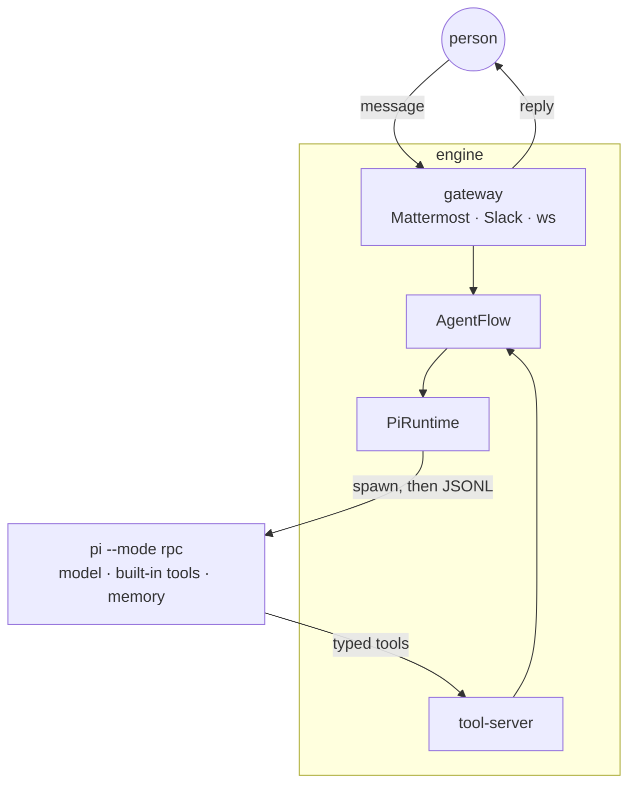

<div align="center">

<picture>
  <source media="(prefers-color-scheme: dark)" srcset="docs/assets/logo-dark.png">
  
</picture>

**A personal multi-agent system for chat.**

[](https://github.com/rsuchkov/impi-agent/releases)
[](.python-version)
[](https://github.com/earendil-works/pi)

[Install](#install) · [Docs](docs/README.md) · [Architecture](docs/architecture.md) · [Changelog](CHANGELOG.md)

</div>

---

Each agent is a bot account on a chat platform (Mattermost or Slack) with its
own personality and tools. One deployment runs many of them and routes
conversations between people and agents — and between agents.

## What it does

- **Many agents, one deployment.** Each with its own personality, its own tool
  allowlist, and its own model if it needs one. → [creating-agents.md](docs/creating-agents.md)
- **Answers you can click.** Buttons, forms and approval cards in the chat
  itself, so a turn can ask before it acts. → [creating-agents.md](docs/creating-agents.md)
- **Skills you hand out.** A shared library installed from a directory or a
  repository, given to the agents that need it. → [skills.md](docs/skills.md)
- **Work on a schedule.** One-off and recurring runs, and an honest account of
  a run that did not happen. → [tasks.md](docs/tasks.md)
- **Secrets an agent can use but never read.** A broker in its own container
  holds the credential, asks a human, and hands the value to a process — never
  into the model's context. → [secrets.md](docs/secrets.md)
- **A real browser.** Headless Chrome in a container of its own, driven over
  `playwright-cli`, on a network that cannot reach the chat server.
  → [browsing.md](docs/browsing.md)
- **A container per agent.** Optional: its own image, its own volumes, its own
  broker certificate. → [agent-containers.md](docs/agent-containers.md)
- **State that need not live with the engine.** Conversations, schedules and
  approvals in a SQLite file by default, or on a database of their own when the
  engine should be replaceable. → [storage.md](docs/storage.md)
- **Files in both directions.** Attachments people send, files and screenshots
  agents send back. → [files.md](docs/files.md)
- **Your own services.** Plug a program in over WebSocket as if it were another
  chat platform. → [ws-gateway.md](docs/ws-gateway.md)

## How it works

The engine does **not** call an LLM directly. Every agent turn is delegated to
the external [`pi`](https://github.com/earendil-works/pi) coding agent, driven
over line-delimited JSON. `pi` owns the model connection, the built-in tools and
the agent's on-disk memory; the engine owns identity, routing, persistence,
interactivity, and the domain tools.



By default `pi` runs as a child process of the engine. With
[agent containers](docs/agent-containers.md) it runs in the agent's own
container instead, behind `runtime-relay`, and the engine reaches it over a
network only the two of them share.

## Status

Early development (see [`VERSION`](VERSION); pre-1.0 under SemVer, so interfaces
and layout may still change). Usable for its purpose, but not yet
production-hardened.

## Install

The one-liner deploys impi (and optionally a Mattermost Team Edition) with
compose, walks you through an interactive setup, and creates your first agents:

```bash
curl -fsSL https://raw.githubusercontent.com/rsuchkov/impi-agent/main/install.sh | bash
```

Needs Linux or macOS, git, and Docker (compose v2) or podman. Afterwards manage
the deployment with the `impi` wrapper (`impi status|logs|restart|reload|agent
add|agent sync|update|doctor|uninstall`). Full guide: [docs/installation.md](docs/installation.md).

The rest of this README is the **development** setup — running the engine from
a checkout.

## Repository layout

This is a [uv](https://docs.astral.sh/uv/) workspace of six packages:

- **`packages/crucible`** — a reusable agent-runtime library: platform gateways,
  the `pi` runtime driver, typed tools, interactivity, session storage, and the
  neutral ports everything is built against. Knows nothing about any specific
  application. See [`packages/crucible/README.md`](packages/crucible/README.md).
- **`packages/impi`** — the application: multi-agent wiring, the Mattermost/Slack
  gateway factory, inter-agent choreography tools, and the bundled `support`
  agent. It composes crucible into a running engine.
- **`packages/ward`** — the optional secret broker: a second, much smaller
  application on the same library, deployed in its own container beside the
  store it opens. See [docs/secrets.md](docs/secrets.md).
- **`packages/wardline`** — the tool that talks to it: `secret-exec` for an
  agent, `ward-admin` for an operator, and the vocabulary they share.
- **`packages/browser-relay`** — the optional browser container's front door, in
  Go: it fronts Chrome's debugging port, starts Chrome on the first client and
  stops it when the last one leaves, so an idle deployment does not pay for it.
- **`packages/runtime-relay`** — the same shape, for an agent's own container:
  it starts that agent's runtime when the engine asks and relays it. Ships in
  the agent image and imports nothing else in the workspace.
  See [docs/agent-containers.md](docs/agent-containers.md).

## Prerequisites

- **[uv](https://docs.astral.sh/uv/)** and **Python 3.13** (`.python-version`).
- **The `pi` CLI on `PATH`** — `npm i -g @earendil-works/pi-coding-agent`
  (requires Node.js). Authenticate it once (`pi` supports a subscription login or
  an OpenAI-compatible endpoint — see [docs/runtime-notes.md](docs/runtime-notes.md)).
- **podman or docker** — only for the local Mattermost stack in development.

## Quickstart

```bash
# 1. Install dependencies
make install

# 2. Start a local Mattermost (http://localhost:8065 — create the admin + a team)
podman compose up -d          # or: docker compose up -d

# 3. In Mattermost, create a bot account and copy its access token
#    (System Console → Integrations → Bot Accounts).

# 4. Configure the engine
cp .env.example .env
#    - set AGENTS_PATH to a directory that holds your agents
#    - add the bot token. The simplest first agent is the bundled `support`
#      agent: set AGENTS_MM_TOKEN__SUPPORT=<token> and it appears automatically.

# 5. Run
make run
```

To add your own agent (its profile, tools, and personality), see
[docs/creating-agents.md](docs/creating-agents.md).

## Common commands

| Command | What it does |
|---|---|
| `make install` | `uv sync` — install the workspace |
| `make run` | run the engine in the foreground |
| `make run-bg` | run in the background, logging to `data/logs/engine.log` |
| `make stop` | signal the engine to stop and sweep orphaned `pi` children |
| `make reload` | hot-reload agent profiles (re-read every `agent.yaml` + `.pi/`) |
| `make test` | run the test suite |
| `make lint` | ruff + import-linter (layer boundaries) + pyright |
| `make installer-lint` | shellcheck + syntax check for the installer scripts |
| `make installer-test` | bats unit tests for the installer libraries |
| `make relay-lint` / `make relay-test` | `go vet` + tests for the browser relay (skipped without Go) |
| `make e2e-install` | full throwaway install via compose (Linux; slow) |
| `make e2e-install BROWSER=1` | the same, with the browser axis driven end to end |
| `make e2e-install AGENTS=1` | the same, with each agent in a container of its own |

## Documentation

- [docs/installation.md](docs/installation.md) — the installer, the `impi` wrapper, updates.
- [docs/architecture.md](docs/architecture.md) — how the engine works, the layers, and the request flows.
- [docs/creating-agents.md](docs/creating-agents.md) — write and register an agent.
- [docs/skills.md](docs/skills.md) — the shared skill library and `/skills`.
- [docs/tasks.md](docs/tasks.md) — scheduled and recurring work, and why a run didn't happen.
- [docs/secrets.md](docs/secrets.md) — credentials an agent can use but never read.
- [docs/browsing.md](docs/browsing.md) — a real browser the agents drive, and what isolates it.
- [docs/agent-containers.md](docs/agent-containers.md) — a container per agent, and what that isolates.
- [docs/files.md](docs/files.md) — files and photos, in both directions.
- [docs/commands.md](docs/commands.md) — slash commands and shortcuts, and how to answer one privately.
- [docs/ws-gateway.md](docs/ws-gateway.md) — plug your own service in over WebSocket.
- [docs/storage.md](docs/storage.md) — where the engine's state lives, and what a backend does not move.
- [docs/configuration.md](docs/configuration.md) — every `.env` / config knob.
- [docs/runtime-notes.md](docs/runtime-notes.md) — the `pi` flags and facts the engine relies on.
- [docs/troubleshooting.md](docs/troubleshooting.md) — common issues and how to diagnose them.

The `docs/` tree is deliberately also a runtime knowledge base: the bundled
`support` agent reads it to answer questions about the engine and build agents.
